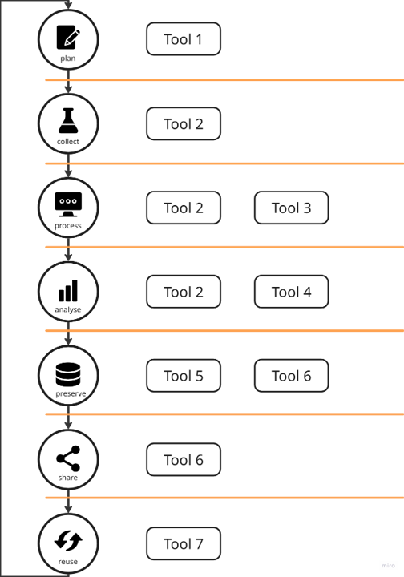

### What are tool assemblies?
Researchers work with a wide range of applications, software, and computational workflows 
throughout their research journey and data life cycle. 
The specific tools they use vary greatly depending on the research domain and data type.

To ensure that data can be effectively used and reused, these tools must be:
- easy to find
- technically and functionally interoperable
- semantically interoperable (meaning data can meaningfully flow between tools).

Tool assemblies are integrated sets of tools, bundled with supporting resources like manuals,
scripts, configuration files, and training materials. 
They help researchers smoothly navigate all phases of the research journey and data life cycle.

These integrated sets will ultimately be made accessible through the 
[National Health Data Portal](https://www.healthdata.nl/en), giving users a clear and central entry point to find the right resources.

### Tool assemblies and the data life cycle

The tools can be mapped to the different stages of the [data life cycle]({{site.baseurl}}/data_lifecycle)
to provide an overview of which tools are used during each phase of the 
research process and to identify which tools need to be functionally connected 
(i.e. the output of one tool serves as the input for another).

